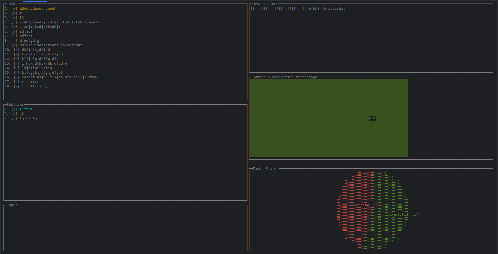

# Termile

**Termile** is a terminal-based task manager built in Go, designed for managing tasks and subtasks using a command-line interface with a terminal UI. It features task creation, editing, deletion, subtask management, and persistence through a JSON file.

## Demo



The GIF above shows a sample run of the **Termile** application, demonstrating task creation, editing, and completion in the terminal UI.

## Features

- Add, edit, and remove tasks and subtasks.
- Mark tasks and subtasks as complete/incomplete.
- Persistent task storage in a `tasks.json` file.
- Terminal UI powered by `termui` library for easy navigation and task management.

## Project Structure

```bash
Termile
├── cmd/
│   └── taskcli/
│       └── main.go        # Entry point for the application
├── internal/
│   ├── ui/
│   │   └── ui.go          # Terminal UI implementation
│   ├── task/
│   │   └── task.go        # Task and TaskManager structs and logic
├── pkg/
│   └── storage/
│       └── storage.go     # Logic for loading and saving tasks to a JSON file
├── tasks.json             # JSON file for persisting tasks (auto-created)
├── go.mod                 # Go module file
└── go.sum                 # Go dependencies file
```

## Installation

To get started with Termile, you need to have Go installed on your system. You can install it from [Go's official website](https://golang.org/dl/).

1. Clone the repository:
    ```bash
    git clone https://github.com/alirezaebrahimi5/termile.git
    ```

2. Navigate to the project directory:
    ```bash
    cd termile
    ```

3. Build the project:
    ```bash
    go build -o termile ./cmd/taskcli
    ```

4. Run the application:
    ```bash
    ./termile
    ```

## Usage

### Keyboard Controls

- **`Ctrl-q` / `Ctrl-C`**: Quit the application.
- **`Ctrl-a`**: Add a new task.
- **`Ctrl-A`**: Add a subtask (in subtask mode).
- **`Ctrl-e`**: Edit the selected task or subtask.
- **`Ctrl-s`**: Toggle between task and subtask mode.
- **`Ctrl-d`**: Delete the selected task or subtask.
- **`<Enter>`**: Confirm the creation or edit of a task/subtask.
- **`Ctrl-t`**: Mark the selected task or subtask as complete/incomplete.
- **`Ctrl-j` / `<Down>`**: Move the selection down.
- **`Ctrl-k` / `<Up>`**: Move the selection up.

### Task Management

- **Add Task**: Press `Ctrl-a` and type in the task description. Press `<Enter>` to save the task.
- **Add Subtask**: While in task mode, press `Ctrl-s` to switch to subtask mode. Press `Ctrl-A` to add a subtask.
- **Edit Task or Subtask**: Select a task (or subtask), press `Ctrl-e` to edit its title, then confirm with `<Enter>`.
- **Delete Task or Subtask**: Select a task (or subtask), then press `Ctrl-d` to delete it.

### Saving and Loading Tasks

Tasks are automatically saved to `tasks.json` upon exiting the application. The tasks will be loaded automatically when you restart the application.

## Dependencies

Termile uses the following Go libraries:

- **[gizak/termui/v3](https://github.com/gizak/termui)**: A library for building terminal-based user interfaces.

Install dependencies by running:

```bash
go mod tidy
```

## Contributing

If you'd like to contribute to the project:

1. Fork the repository.
2. Create a new feature branch (`git checkout -b feature-branch`).
3. Commit your changes (`git commit -m 'Add some feature'`).
4. Push the branch (`git push origin feature-branch`).
5. Open a pull request.

## License

This project is licensed under the MIT License. See the [LICENSE](LICENSE) file for details.

---

**Termile** - Efficient task management right in your terminal!
```
